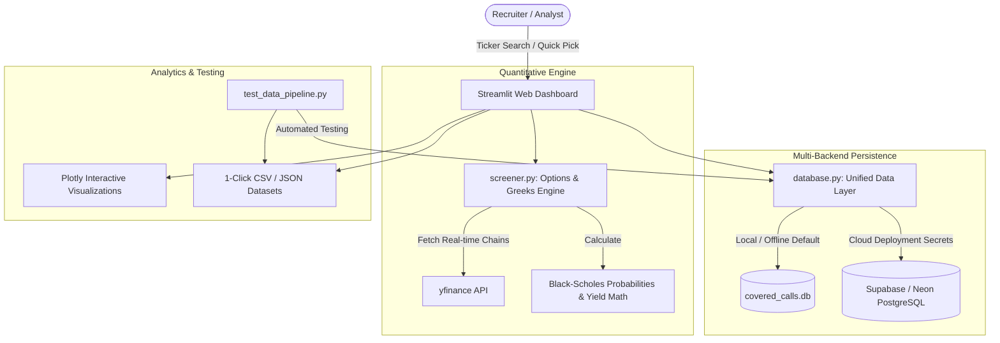

# 📈 Covered Call Screener & Yield Engine

[](https://share.streamlit.io/)


A modern quantitative web application, options mathematical engine, and historical backtesting system for screening stock Covered Calls using `yfinance`, Plotly, SQLite, and cloud PostgreSQL (Supabase / Neon).

Developed by **Asjad P.** ([GitHub @asjadp](https://github.com/asjadp))

---

## 📌 Architecture & Data Flow



---

## ✨ Key Features

- **Dynamic Ticker & Company Name Resolution**: Search by ticker (e.g. `AAPL`, `NVDA`, `TSLA`, `SPY`) or plain English company names (e.g. `Apple`, `Microsoft`, `Nvidia`).
- **Target Expirations & OTM Strikes**: Dynamically scans ~60-day (~2-month) and ~90-day (~3-month) expiration cycles targeting **+5% OTM** and **+10% OTM** strikes.
- **Quantitative Greeks & Probabilities (Black-Scholes)**:
  - **Implied Volatility (`IV %`) & Delta**: Real-time contract volatility and price sensitivity.
  - **$\text{Prob. ITM (\%)} = N(d_2)$**: Probability the option expires in-the-money.
  - **$\text{Prob. Hit Strike (\%)} \approx \min(100\%, 2 \times N(d_2))$**: Probability stock price touches or exceeds strike price before expiration based on Brownian motion reflection principle.
- **Yield & ROI Calculations**:
  - Premium Yield (%) & Annualized Premium Yield (%).
  - Max ROI (%) & Annualized Max ROI (%) factoring capital appreciation.
  - Downside Breakeven cushion ($).
- **Multi-Backend Cloud & Local Persistence**:
  - Automatically persists screening runs with timestamps and metadata.
  - Supports **Local SQLite** (`covered_calls.db`) for zero-config local testing.
  - Supports **Cloud PostgreSQL (Supabase / Neon)** via `DATABASE_URL` secrets for permanent cloud data storage across container restarts.
- **Automated Data Testing & Benchmark Datasets**:
  - Includes `test_data_pipeline.py` which validates API integrity, checks mathematical formulas, screens benchmark portfolios, and exports sample datasets (`data/sample_options_dataset.csv` and `.json`).

---

## 📐 Mathematical Formulation

### 1. Black-Scholes In-The-Money Probability ($N(d_2)$)

$$d_2 = \frac{\ln(S / K) + (r - \frac{1}{2}\sigma^2)T}{\sigma \sqrt{T}}$$

$$\text{Prob. ITM} = N(d_2) = \frac{1}{2} \left[ 1 + \text{erf}\left(\frac{d_2}{\sqrt{2}}\right) \right]$$

### 2. Strike Touch / First-Passage Probability

$$\text{Prob. Hit Strike} \approx \min\left(100\%, 2 \times N(d_2)\right)$$

### 3. Covered Call Annualized Yields

$$\text{Annualized Premium Yield (\%)} = \left(\frac{\text{Premium}}{S}\right) \times \left(\frac{365}{\text{DTE}}\right) \times 100$$

$$\text{Annualized Max ROI (\%)} = \left(\frac{(K - S) + \text{Premium}}{S}\right) \times \left(\frac{365}{\text{DTE}}\right) \times 100$$

$$\text{Breakeven Price (\$)} = S - \text{Premium}$$

---

## 🚀 Live Deployment Guide (Streamlit Community Cloud)

Deploying this app live for recruiters is 100% free and takes under 2 minutes:

### Step 1: Create GitHub Repository & Push Code
In your local terminal:
```powershell
# 1. Initialize and commit
git init
git add .
git commit -m "feat: complete covered call screener with cloud persistence and data testing"

# 2. Add your GitHub remote (replace with your repo URL)
git branch -M main
git remote add origin https://github.com/asjadp/covered-calls-screener.git
git push -u origin main
```

### Step 2: Deploy on Streamlit Community Cloud
1. Go to [share.streamlit.io](https://share.streamlit.io/) and log in with your GitHub account (`asjadp`).
2. Click **"New app"**.
3. Fill in the deployment details:
   - **Repository**: `asjadp/covered-calls-screener`
   - **Branch**: `main`
   - **Main file path**: `app.py`
   - **App URL**: `https://asjadp-covered-calls.streamlit.app` (or custom subdomain)
4. Click **"Deploy!"**.

### Step 3: (Optional) Connect Free Supabase / Neon Cloud Database
To persist historical screening records permanently in the cloud:
1. Create a free database at [Supabase.com](https://supabase.com) or [Neon.tech](https://neon.tech).
2. Copy your PostgreSQL Connection URI.
3. In Streamlit Cloud, go to **App Settings > Secrets** and paste:
   ```toml
   DATABASE_URL = "postgresql://postgres:[PASSWORD]@[HOST]:5432/postgres"
   ```
4. Save. The app will immediately switch from SQLite to Cloud PostgreSQL!

---

## 🧪 Data Testing & Benchmark Pipeline

Run the automated data testing pipeline to test `yfinance` connectivity, verify Black-Scholes math, and export fresh benchmark datasets:

```powershell
python test_data_pipeline.py
```

Generated datasets will be saved to:
- `data/sample_options_dataset.csv`
- `data/sample_options_dataset.json`

---

## 🛠 Local Development Setup

### 1. Clone & Install Dependencies
```powershell
git clone https://github.com/asjadp/covered-calls-screener.git
cd covered-calls-screener
pip install -r requirements.txt
```

### 2. Launch Local Dashboard
```powershell
streamlit run app.py
```

---

## 📁 Repository Structure

```text
covered-calls-screener/
├── app.py                      # Main Streamlit web dashboard & interactive tabs
├── screener.py                 # Option fetching, Black-Scholes probability & yield math
├── database.py                 # Multi-backend persistence (PostgreSQL + SQLite) & migrations
├── test_data_pipeline.py       # Automated data testing suite & benchmark dataset generator
├── requirements.txt            # Production dependencies
├── .gitignore                  # Git ignore rules
├── .streamlit/
│   ├── config.toml             # Recruiter-grade UI theme & server settings
│   └── secrets.toml.example    # Secrets template for cloud DB setup
├── data/
│   ├── sample_options_dataset.csv   # Exported benchmark options dataset
│   └── sample_options_dataset.json  # Exported benchmark JSON dataset
├── covered_calls.db            # Local SQLite database file
├── PROJECT_NOTES.md            # Technical design notes
└── README.md                   # Project documentation
```

---

## 📄 License
This project is open-source under the [MIT License](LICENSE).
